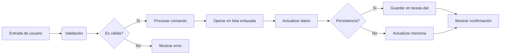

# 🚀 Gestor de Tareas en C

**Gestor de Tareas** es una aplicación de consola desarrollada en lenguaje **C** que permite administrar tareas personales o de equipo de forma simple, eficiente y con persistencia de datos. A través de un menú interactivo, el usuario puede agregar, modificar, buscar, eliminar y ordenar tareas, además de marcarlas como completadas. Todos los cambios se guardan en un archivo binario (`tareas.dat`), lo que permite conservar el historial entre ejecuciones.

```mermaid
graph TD
    A[Inicio] --> B[Cargar datos de tareas.dat]
    B --> C[Mostrar menú principal]
    C --> D{Opción seleccionada}
    D -->|1| E[Agregar nueva tarea]
    D -->|2| F[Mostrar todas las tareas]
    D -->|3| G[Buscar tareas]
    D -->|4| H[Ordenar tareas]
    D -->|5| I[Modificar tarea]
    D -->|6| J[Marcar como completada]
    D -->|7| K[Eliminar tarea]
    D -->|8| L[Guardar datos]
    D -->|9| M[Salir]
    E --> C
    F --> C
    G --> C
    H --> C
    I --> C
    J --> C
    K --> C
    L --> C
    M --> N[Guardar datos automáticamente?]
    N -->|Sí| O[Guardar en tareas.dat]
    O --> P[Liberar memoria]
    N -->|No| P
    P --> Q[Fin]
````

## 👥 Integrantes del Grupo

| Nombre       | Apellido  | Rol                                         | Contribuciones clave                                                                                                                   |
| ------------ | --------- | ------------------------------------------- | -------------------------------------------------------------------------------------------------------------------------------------- |
| **Emmanuel** | Ruiz      | Desarrollo principal y coordinación técnica | Implementación base del sistema, diseño del menú, estructuras de datos, manejo de archivos binarios y lógica central del programa      |
| **Kenzo**    | Kairiyama | Desarrollo y documentación                  | Implementación de funciones de búsqueda y filtrado, revisión del código, redacción de documentación interna y de usuario               |
| **Kevin**    | Piña      | Desarrollo y pruebas                        | Implementación del ordenamiento por prioridad y fecha, validaciones de entrada, pruebas funcionales en Windows y sugerencias de mejora |

## 🔗 Enlace al Repositorio Público

[https://github.com/EmmanuelR15/TaskManager](https://github.com/EmmanuelR15/TaskManager)

## ✅ Compilación y Ejecución

**El código compila y se ejecuta sin errores** en Windows y Linux

### Requisitos previos

* Compilador GCC (Linux) o MinGW (Windows)
* Terminal o línea de comandos

### 🐧 Instrucciones para Linux

```bash
# Clonar repositorio
git clone https://github.com/EmmanuelR15/TaskManager.git

# Entrar al directorio
cd TaskManager

# Compilar el programa
gcc -o gestor_tareas main.c

# Ejecutar
./gestor_tareas
```

### 🪟 Instrucciones para Windows

1. Instalar [MinGW](https://osdn.net/projects/mingw/)
2. Ejecutar en CMD/PowerShell:

```cmd
git clone https://github.com/EmmanuelR15/TaskManager.git
cd TaskManager
gcc -o gestor_tareas.exe main.c
gestor_tareas
```

## 📋 Descripción del Proyecto

Gestor de tareas en C con persistencia en archivos binarios que permite:

* ✨ **Crear tareas** con título, descripción, responsable y prioridad (1-5)
* 🔍 **Buscar/filtrar** por estado, responsable o título
* 📊 **Ordenar** por prioridad o fecha
* 📝 **Modificar** cualquier campo existente
* ✅ **Marcar como completadas** las tareas finalizadas
* 🗑️ **Eliminar** con confirmación para evitar errores
* 💾 **Guardado automático** en `tareas.dat`

## 🧠 Estructuras Clave del Programa

```c
typedef enum { 
    PENDIENTE, 
    EN_PROGRESO, 
    COMPLETADA 
} Estado;

typedef struct {
    int id;  // ID único automático
    char titulo[MAX_TITULO];
    char descripcion[MAX_DESC];
    char responsable[MAX_NOMBRE];
    Estado estado;
    int prioridad;  // 1 = máxima, 5 = mínima
    time_t fecha;   // Fecha de creación automática
} Tarea;

typedef struct Nodo {
    Tarea tarea;
    struct Nodo *siguiente;  // Lista enlazada simple
} Nodo;
```

## 🖥️ Menú Principal

```
===== GESTOR DE TAREAS =====
1. Agregar tarea
2. Mostrar todas las tareas (ordenadas por prioridad)
3. Buscar tareas
4. Ordenar tareas (criterios avanzados)
5. Modificar tarea
6. Marcar como completada
7. Eliminar tarea
8. Guardar datos
9. Salir
```

## 📝 Ejemplo de Uso

```plaintext
> Opción 1: Agregar tarea
Titulo: Preparar presentación
Descripción: Crear slides para reunión
Responsable: Emmanuel Ruiz
Prioridad (1-5): 2
Estado (0=Pend, 1=Prog, 2=Comp): 1

> Opción 2: Mostrar tareas
[ID: 1 | Pri: 2 | Preparar presentación | En progreso]

> Opción 6: Completar tarea
ID a completar: 1
[+] Tarea marcada como completada

> Opción 8: Guardar datos
[+] Datos guardados (1 tarea)
```

## 📊 Diagrama de Flujo de Datos



## 💾 Persistencia de Datos

* Datos almacenados en `tareas.dat` (formato binario)
* Estructura de almacenamiento:

  ```c
  struct TareaArchivo {
      int id;
      char titulo[100];
      char descripcion[250];
      char responsable[50];
      int estado;
      int prioridad;
      time_t fecha;
  };
  ```
* Carga automática al iniciar el programa
* Guardado manual (Opción 8) o automático al salir

---

## 💡 Contribuciones Clave

* **Gestión con listas enlazadas**: Las tareas se almacenan dinámicamente en memoria usando listas enlazadas simples, lo que permite inserciones y eliminaciones eficientes.
* **Persistencia binaria robusta**: Lectura y escritura en `tareas.dat` para mantener datos entre sesiones.
* **Menú interactivo y modular**: Separación clara entre funcionalidades como agregar, modificar, buscar o eliminar tareas.
* **Ordenamiento y filtrado personalizado**: Implementación de funciones para ordenar tareas por prioridad o fecha, y búsqueda por criterios específicos.
* **Control de estado y seguimiento**: Las tareas pueden marcarse como pendientes, en progreso o completadas, permitiendo un seguimiento efectivo del flujo de trabajo.
