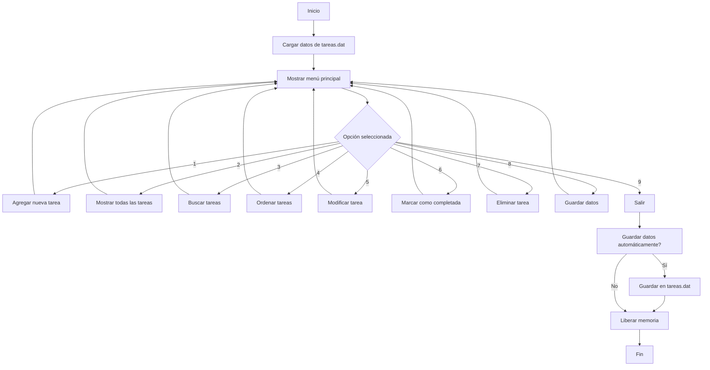
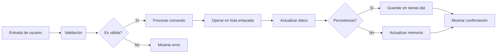

# 🚀 Gestor de Tareas en C



## 👥 Integrantes del Grupo

| Nombre    | Apellido    | DNI       | Correo electrónico          | Rol                          |
|-----------|-------------|-----------|-----------------------------|------------------------------|
| Emmanuel  | Ruiz        | 45.558.596| emmausruiz@gmail.com        | Desarrollo principal         |
| Kevin     | Piña        | 45.051.423| keviin273xd@gmail.com       | Desarrollo y pruebas         |
| Kenzo     | Kairiyama   | 43.530.025| kenzokairiyama@icloud.com   | Desarrollo y documentación   |

## 🔗 Enlace al Repositorio Público
[https://github.com/EmmanuelR15/TaskManager](https://github.com/EmmanuelR15/TaskManager)

## ✅ Compilación y Ejecución
**El código compila y se ejecuta sin errores** en Windows y Linux

### Requisitos previos
- Compilador GCC (Linux) o MinGW (Windows)
- Terminal o línea de comandos

### 🐧 Instrucciones para Linux
```bash
# Clonar repositorio
git clone https://github.com/EmmanuelR15/TaskManager.git

# Entrar al directorio
cd TaskManager

# Compilar el programa
gcc -o gestor_tareas main.c

# Ejecutar
./gestor_tareas
```

### 🪟 Instrucciones para Windows
1. Instalar [MinGW](https://osdn.net/projects/mingw/)
2. Ejecutar en CMD/PowerShell:
```cmd
git clone https://github.com/EmmanuelR15/TaskManager.git
cd TaskManager
gcc -o gestor_tareas.exe main.c
gestor_tareas
```

## 📋 Descripción del Proyecto
Gestor de tareas en C con persistencia en archivos binarios que permite:

- ✨ **Crear tareas** con título, descripción, responsable y prioridad (1-5)
- 🔍 **Buscar/filtrar** por estado, responsable o título
- 📊 **Ordenar** por prioridad o fecha
- 📝 **Modificar** cualquier campo existente
- ✅ **Marcar como completadas** las tareas finalizadas
- 🗑️ **Eliminar** con confirmación para evitar errores
- 💾 **Guardado automático** en `tareas.dat`

## 🧠 Estructuras Clave del Programa
```c
typedef enum { 
    PENDIENTE, 
    EN_PROGRESO, 
    COMPLETADA 
} Estado;

typedef struct {
    int id;  // ID único automático
    char titulo[MAX_TITULO];
    char descripcion[MAX_DESC];
    char responsable[MAX_NOMBRE];
    Estado estado;
    int prioridad;  // 1 = máxima, 5 = mínima
    time_t fecha;   // Fecha de creación automática
} Tarea;

typedef struct Nodo {
    Tarea tarea;
    struct Nodo *siguiente;  // Lista enlazada simple
} Nodo;
```

## 🖥️ Menú Principal
```
===== GESTOR DE TAREAS =====
1. Agregar tarea
2. Mostrar todas las tareas (ordenadas por prioridad)
3. Buscar tareas
4. Ordenar tareas (criterios avanzados)
5. Modificar tarea
6. Marcar como completada
7. Eliminar tarea
8. Guardar datos
9. Salir
```

## 📝 Ejemplo de Uso
```plaintext
> Opción 1: Agregar tarea
Titulo: Preparar presentación
Descripción: Crear slides para reunión
Responsable: Emmanuel Ruiz
Prioridad (1-5): 2
Estado (0=Pend, 1=Prog, 2=Comp): 1

> Opción 2: Mostrar tareas
[ID: 1 | Pri: 2 | Preparar presentación | En progreso]

> Opción 6: Completar tarea
ID a completar: 1
[+] Tarea marcada como completada

> Opción 8: Guardar datos
[+] Datos guardados (1 tarea)
```

## 📊 Diagrama de Flujo de Datos


## 💾 Persistencia de Datos
- Datos almacenados en `tareas.dat` (formato binario)
- Estructura de almacenamiento:
  ```c
  struct TareaArchivo {
      int id;
      char titulo[100];
      char descripcion[250];
      char responsable[50];
      int estado;
      int prioridad;
      time_t fecha;
  };
  ```
- Carga automática al iniciar el programa
- Guardado manual (Opción 8) o automático al salir

## 📄 Licencia
MIT License - Ver [LICENSE](https://github.com/EmmanuelR15/TaskManager/blob/main/LICENSE) para detalles completos.

## 📬 Entrega del Proyecto
1. **Repositorio público**: [https://github.com/EmmanuelR15/TaskManager](https://github.com/EmmanuelR15/TaskManager)
2. **Código verificado**: Compila y ejecuta sin errores
3. **Datos de integrantes**: 
   - Ruiz Emmanuel, DNI 45.558.596, emmausruiz@gmail.com
   - Kevin Piña, DNI 45.051.423, keviin273xd@gmail.com
   - Kenzo Kairiyama, DNI 43.530.025, kenzokairiyama@icloud.com
4. **Instrucciones completas**: Incluidas en este documento
